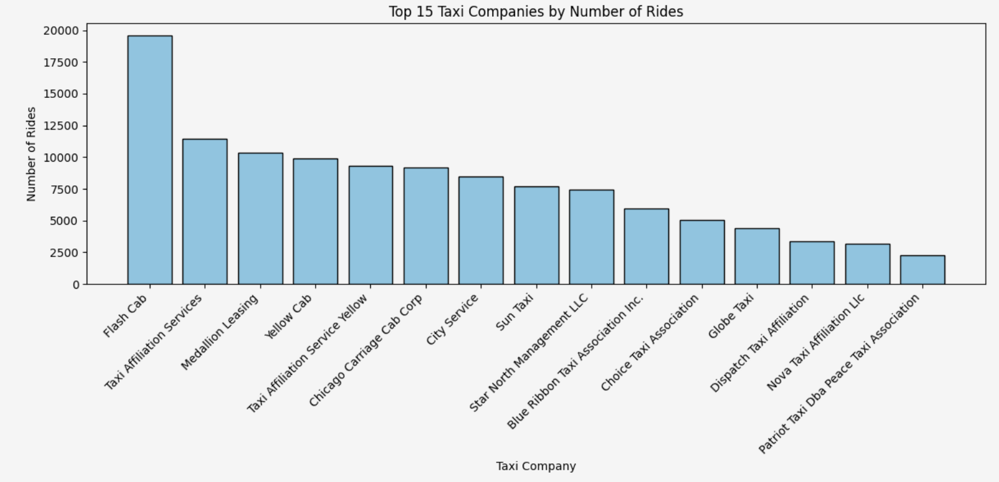
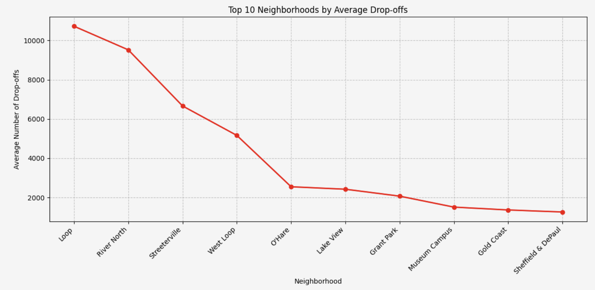

# Chicago Taxi Ride Analysis

By James Weaver

## Introduction

This project focuses on analyzing taxi ride data in Chicago for Zuber, a new ride-sharing company preparing to launch in the city. The objective is to understand passenger preferences, identify the most active taxi companies, find the most popular drop-off neighborhoods, and test whether weather conditions affect ride duration from the Loop to O'Hare International Airport.

The analysis uses SQL query results, exploratory data analysis, visualizations, and statistical hypothesis testing to uncover patterns in Chicago taxi rides during November 2017.

## Files

1. `nb.ipynb`  
   The main Jupyter Notebook containing the code for data loading, data inspection, exploratory data analysis, visualizations, and statistical hypothesis testing.

2. `project_sql_result_01.csv`  
   Dataset containing taxi company names and the number of rides for each company on November 15-16, 2017.

3. `project_sql_result_04.csv`  
   Dataset containing Chicago drop-off neighborhoods and the average number of rides that ended in each neighborhood during November 2017.

4. `project_sql_result_07.csv`  
   Dataset containing rides from the Loop to O'Hare International Airport, including pickup time, weather conditions, and ride duration.

5. `README.md`  
   Overview of the project, methodology, tools used, key findings, recommendations, and future improvements.

## Approach

1. Data Collection & SQL Querying
   * Retrieved taxi ride data from a database containing taxi companies, trips, neighborhoods, and weather records.
   * Used SQL to calculate the number of rides by taxi company.
   * Grouped taxi companies based on ride volume and compared the most popular companies.
   * Joined trip data with weather data using ride start time and weather record time.
   * Filtered rides that started in the Loop and ended at O'Hare International Airport on Saturdays.

2. Data Preparation
   * Imported the SQL result CSV files into Python.
   * Inspected the datasets for missing values and correct data types.
   * Confirmed that the taxi company and neighborhood datasets had no missing values.
   * Converted the `start_ts` column to datetime format for proper time-based analysis.
   * Removed missing ride duration values where needed to keep the hypothesis test accurate.

3. Exploratory Data Analysis `EDA`
   * Identified the top taxi companies by number of rides.
   * Found the top 10 Chicago neighborhoods by average number of drop-offs.
   * Compared ride activity across companies and neighborhoods.
   * Created visualizations to make the main patterns easier to understand.

4. Statistical Hypothesis Testing
   * Tested whether the average duration of rides from the Loop to O'Hare changes on rainy Saturdays.
   * Separated ride durations into two groups: `"Good"` weather and `"Bad"` weather.
   * Used an independent two-sample t-test with `equal_var=False`.
   * Set the significance level at `alpha = 0.05`.

## Tools Used

* SQL: Querying, filtering, grouping, joining tables, and preparing datasets.
* Python: Core programming language used for analysis.
* Pandas: Data loading, cleaning, sorting, grouping, and inspection.
* Matplotlib: Creating bar charts and line charts.
* SciPy / Stats: Performing statistical hypothesis testing.
* Jupyter Notebook: Main environment used to organize the project and present the analysis.

## Key Findings

1. Taxi Company Ride Volume
   * Flash Cab had the highest number of rides with 19,558 rides.
   * Taxi Affiliation Services followed with 11,422 rides, and Medallion Leasing had 10,367 rides.
   * The ride-sharing market appears to be dominated by a small number of major taxi companies.

2. Market Concentration
   * There is a steep drop-off in ride volume after the top few companies.
   * This suggests that a few taxi companies control a large share of the Chicago taxi market.

3. Top Drop-off Neighborhoods
   * The Loop had the highest average number of drop-offs with about 10,727 average trips.
   * River North followed with about 9,524 average trips.
   * Streeterville and West Loop were also among the most popular drop-off areas.

4. High-Demand Areas
   * The most popular drop-off locations were central business, tourism, and commercial areas.
   * Neighborhoods like the Loop, River North, and Streeterville likely attract more rides because of offices, restaurants, hotels, entertainment, and tourist activity.

5. Weather Impact on Ride Duration
   * The hypothesis test returned a p-value of `6.738994326108734e-12`.
   * Since the p-value was much lower than the alpha level of `0.05`, the null hypothesis was rejected.
   * This means there is a statistically significant difference in ride duration from the Loop to O'Hare depending on weather conditions.

## Visuals

### Top 15 Taxi Companies by Number of Rides

### Top 10 Neighborhoods by Average Drop-offs

## Recommendations

1. Focus on High-Demand Neighborhoods
   * Zuber should prioritize areas like the Loop, River North, Streeterville, and West Loop because these neighborhoods have the highest average number of drop-offs.

2. Monitor Major Competitors
   * Flash Cab, Taxi Affiliation Services, Medallion Leasing, and Yellow Cab are major competitors with high ride volume.
   * Zuber should study these companies closely and look for ways to compete through pricing, availability, service quality, or faster pickup times.

3. Prepare for Weather-Related Delays
   * Since weather has a statistically significant impact on ride duration, Zuber should plan for longer trip times during bad weather.
   * This could include adding more drivers during rainy Saturdays, improving estimated arrival times, and adjusting airport route expectations.

4. Pay Attention to Airport Routes
   * O'Hare appears as one of the top drop-off locations.
   * Zuber should treat airport rides as an important service area, especially routes from downtown Chicago to O'Hare.

## Future Improvements

* Include more months of ride data to see if the same patterns hold across different seasons.
* Analyze pickup locations in addition to drop-off locations.
* Add more external factors such as traffic, holidays, time of day, and special events.
* Compare ride duration by hour to better understand peak travel periods.
* Build a predictive model to estimate ride duration based on weather, location, and time.
* Create an interactive dashboard to help visualize ride demand by company, neighborhood, and weather condition.
